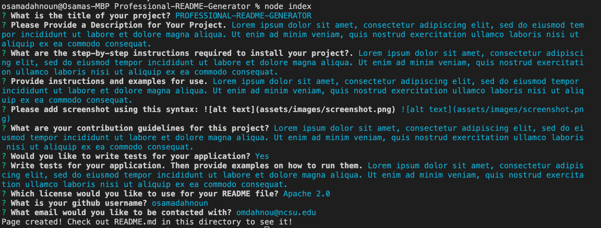

# Professional-README-Generator

## Description
* Professional-README-Generator is an application that prompts the user with a series of questions. It then takes the data that a user inputs and generates a custom and professional README file based on that input
## Table of Contents
* [Installation](#installation)
* [Usage](#usage)
* [Screenshot of Application](#screenshot)
* [Questions](#questions)
* [Contribution](#contribution)

## Built With
* Node.js

## Installation
* Navigate to [My Github Profile](https://www.github.com/osamadahnoun) and clone the Professional-README-Generator onto your computer using the git clone command. From there follow the usage instruction down below.

## Usage
* Please click the link below to watch a walkthrough video on how to use the application once it has been installed.
* [Walkthrough Video](https://watch.screencastify.com/v/MoRQaDWqcDAIREnIqOnh)

## Screenshot
* 

## Questions
* [My Github Profile](https://www.github.com/osamadahnoun)
* If you have any questions, feel free to reach me at omdahnou@ncsu.edu

## Contribution
Professional-README-Generator ❤️ Made With Love by Osama Dahnoun 
 